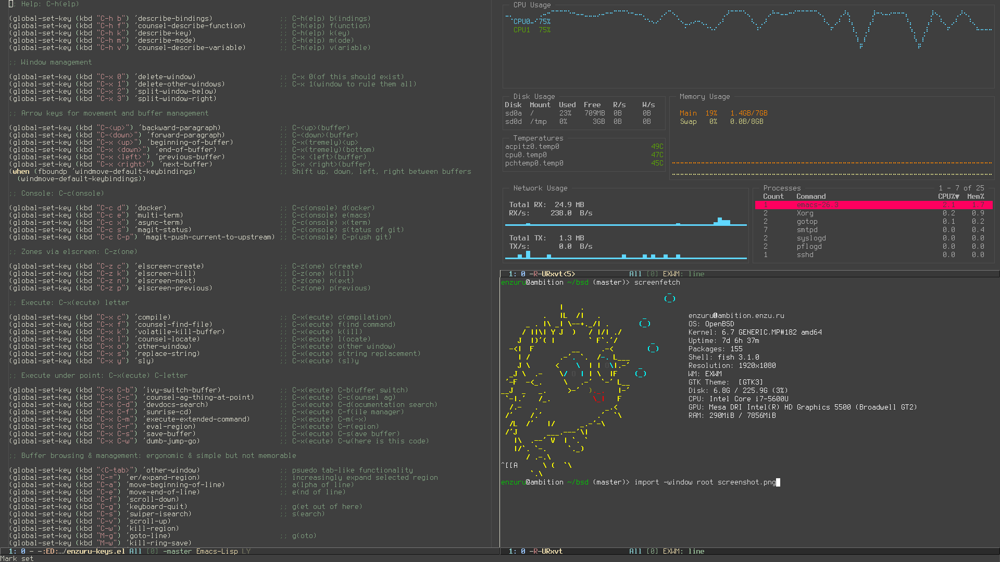

# BSD Lisp machine

## Warning

The maturity of [GNU Guix System](https://guix.gnu.org) has basically made this setup obsolete. If you want a true operating system almost completely hacakable in Lisp, please move on to that distro.

I am attempting to document setting up this "fullstack Lisp" experience on [my GitHub home page](https://www.github.com/enzuru).

## What is this?

These setup scripts build a BSD-based Lisp workstation pictured above after a fresh FreeBSD or OpenBSD install which is how I used to do most of my computing before GNU Guix System. You can adapt these setup scripts to help build your own Lisp workstation; you must modify these scripts because they are designed specifically for my own workstations, but I leave them as FOSS so that users can learn about advanced computing styles. This style of computing is a throwback to the ancient [Lisp machines](https://en.wikipedia.org/wiki/Lisp_machine).

## What software does it use?

| Category              | Selection                                                                                                         |
| ---                   | ---                                                                                                               |
| Operating systems     | [FreeBSD](https://freebsd.org), [OpenBSD](https://openbsd.org)                                                    |
| Programming languages | [Common Lisp](https://lisp-lang.org), [Emacs Lisp](https://www.gnu.org/software/emacs/manual/eintr.html)          |
| Shell                 | [fish](https://fishshell.com)                                                                                     |
| Text editor           | [Emacs](https://www.gnu.org/software/emacs/)                                                                      |
| Window manager        | [exwm](https://github.com/ch11ng/exwm)                                                                            |
| File manager          | [Sunrise Commander](https://medium.com/@enzuru/sunrise-commander-an-orthodox-file-manager-for-emacs-2f92fd08ac9e) |
| Terminal              | [rxvt-unicode](https://wiki.archlinux.org/index.php/Rxvt-unicode)                                                 |
| Version control       | [magit](https://magit.vc)                                                                                         |
| Search                | [the\_silver\_searcher](https://geoff.greer.fm/ag/)                                                               |
| IRC client            | [irssi](https://irssi.org)                                                                                        |
| Font                  | [terminus](http://terminus-font.sourceforge.net)                                                                  |

## Why BSD?

I use the BSD operating systems as a base because I find them to be the cleanest, most consistent, and most stable \*nix operating systems.

## What makes this unique?

The highlight of my workstation is the exwm window manager. exwm turns Emacs into a full-blown [tiling window manager](https://en.wikipedia.org/wiki/Tiling_window_manager) hackable in Lisp. Furthermore, the [Sly](https://github.com/joaotavora/sly) Common Lisp IDE and a few implementations of Common Lisp are shipped.

These scripts clone my [.emacs.d/](https://github.com/enzuru/.emacs.d) in order to provide a Lisp-based window manager and development environment. You should reference my [.emacs.d/enzuru/setup/enzuru-keys.el](https://github.com/enzuru/.emacs.d/blob/master/enzuru/setup/enzuru-keys.el) to learn how to control the system.

## What are the differences between the OpenBSD and FreeBSD setups?

I usually install OpenBSD on laptops and exotic architectures (PowerPC & SPARC64) while dual-booting FreeBSD on my gaming machine (this makes compiling and running `-CURRENT` a breeze). This is why my FreeBSD setup includes installing the Nvidia driver while excluding all "quality of life" settings for laptops.

Also, when I'm on an OpenBSD machine most of my programming is in Common Lisp and Emacs Lisp. When I'm on FreeBSD, I may also hack in Python, Ruby, and JavaScript, as well as do DevOps work with Linux tools like Terraform, Docker, and Kubernetes. You can clearly see this difference in the packages that I choose to install on each operating system.

I've also added to FreeBSD some cool TCP/IP optimizations that I found on a blog post that is no longer online.

Check out [openbsd/setup](openbsd/setup) and [freebsd/setup](freebsd/setup) to see how it all comes together.
